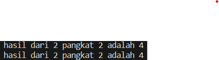
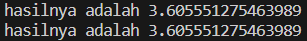
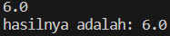
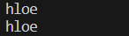
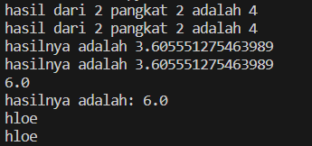
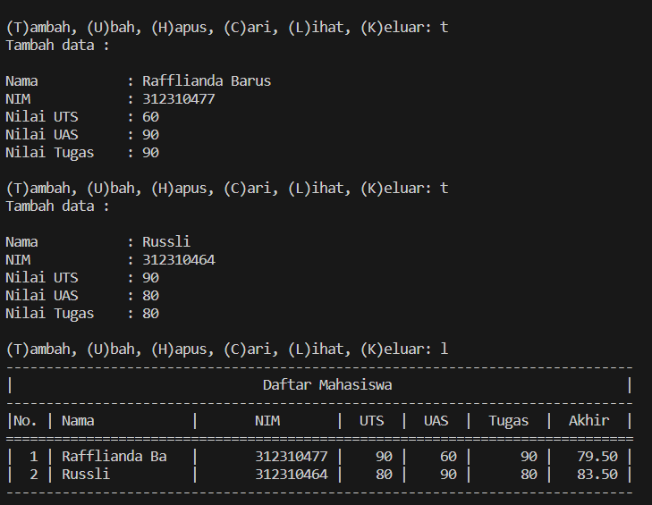
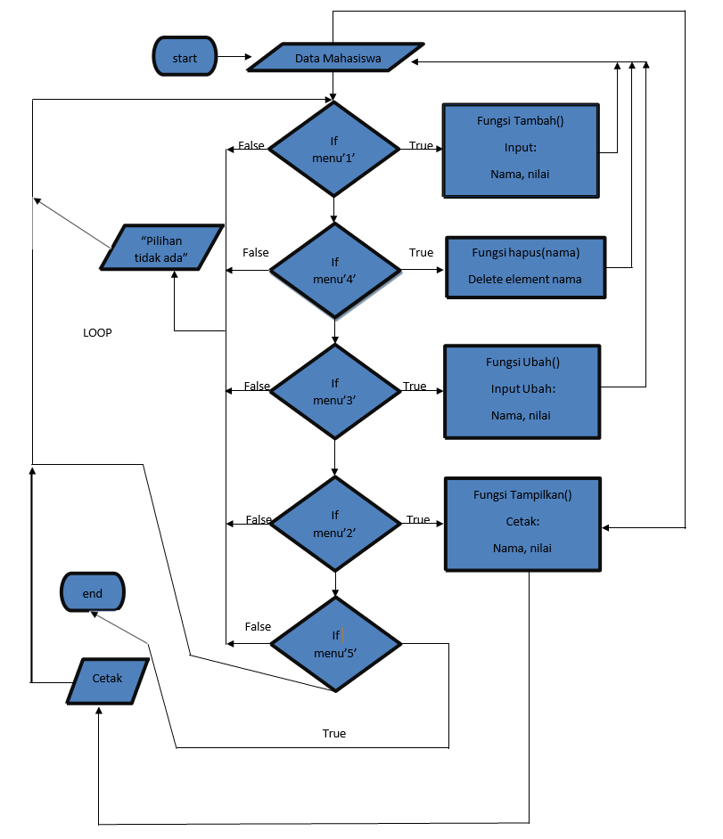

# Pertemuan ke-11
## Profil
| Variable | Isi |
| -------- | --- |
| **Nama** | Rafflianda Barus |
| **NIM** | 312310477 |
| **Kelas** | TI.23.A.5 |
| **Mata Kuliah** | Bahasa Pemrograman |
## Latihan
*Ubahlah kode dibawah ini menjadi fungsi menggunakan lambda
```python
import math

def a(x):
return x**2

def b(x, y):
return math.sqrt(x**2 + y**2)

def c(*args):
return sum(args)/len(args)

def d(s):
return "".join(set(s))
```

## Penjelasan
## Pangkat
```python
def a(x):
    return x**2
print(f'hasil dari 2 pangkat 2 adalah {a(2)}')
# Ubah Menjadi Lambda
pangkat = lambda x : x**2
print(f'hasil dari 2 pangkat 2 adalah {pangkat(2)}')
```
### OUTPUT


## Akar
```python
def b(x, y):
    return math.sqrt(x**2 + y**2)
print(f'hasilnya adalah {b(2,3)}')

# Ubah Menjadi Lambda
b = lambda x,y : math.sqrt(x**2 + y**2)
print(f'hasilnya adalah {b(2,3)}')
```
### OUTPUT


## Pembagian menggunakan *args
```python
def c(*args):
    return sum(args)/len(args)
print(c(2,4,6,8,10)) 

# Ubah Menjadi Lambda
c = lambda *args: sum(args) / len(args)
print(f'hasilnya adalah: {c(2, 4, 6, 8, 10)}')
```
### OUTPUT
<br>
<h3>Ini karena fungsi lambda c menghitung rata-rata dari angka yang diberikan (2 + 4 + 6 + 8 + 10) / 5 = 30 / 5 = 6.0.</h3>

## Fungsi set
```python
def d(s):
    return "".join(set(s))
print(d("hello"))

# Ubah menjadi Lambda
data = [1,2,3,4,5]
d = lambda s: "".join(set(s))
print(d("hello"))
```
### OUTPUT
<br>

><h3>'set(s)': Mengubah string s menjadi himpunan (set), yang akan menghilangkan duplikat karakter.</h3>
## OUTPUT


## Tugas Praktikum
*Buat program sederhana dengan mengaplikasikan penggunaan fungsi
yang akan menampilkan daftar nilai mahasiswa, dengan ketentuan:*
- Fungsi tambah() untuk menambah data
- Fungsi tapilkan() untuk menampilkan data
- Fungsi hapus(nama) untuk menghapus data berdasarkan nama
- Fungsi ubah(nama) untuk mengubah data berdasarkan nama
- Buat flowchart dan penjelasan programnya pada README.md

# Program 
``` Python
list = {}

def garis():
    '''Fungsi garis'''
    print("~"*80)

    # Menambahkan data inputan 
def tambah():
    print("Tambah data :\n")
    nama    = input("Nama           : ")
    nim     = int(input("NIM            : "))
    uts     = int(input("Nilai UTS      : "))
    uas     = int(input("Nilai UAS      : "))
    tugas   = int(input("Nilai Tugas    : "))
    akhir = (tugas * 30/100) + (uts * 35/100) + (uas * 35/100)
    list[nama] = [nim, tugas, uts, uas, akhir]

    # Mengubah data inputan
def ubah():
    print("Ubah Data :")
    nama = input("\nMasukkan Nama  : ")
    if nama in list.keys():
        nim     = int(input("NIM            : "))
        uts     = int(input("Nilai UTS      : "))
        uas     = int(input("Nilai UAS      : "))
        tugas   = int(input("Nilai Tugas    : "))
        akhir = (tugas * 30/100) + (uts * 35/100) + (uas * 35/100)
        list[nama] = [nim, tugas, uts, uas, akhir]
    else:
        print("NAMA {0} TIDAK ADA!".format(nama))

    # Menghapus inputan Nama
def hapus():
    print("Hapus berdasarkan nama inputan :")
    nama = input("\nMasukkan Nama  : ")
    if nama in list.keys():
        del list[nama]
        print("\nData {0} berhasil di hapus".format(nama))
    else:
        print("NAMA {0} TIDAK ADA!".format(nama))

    # Mencari data yg sudah di input
def cari():
    print("Cari data berdasarkan nama inputan :")
    nama = input("\nMasukkan Nama : ")
    if nama in list.keys():
        print(f"\nNama        : {nama}")
        print(f"NIM         : {list[nama][0]}")
        print(f"Nilai UTS   : {list[nama][2]}")
        print(f"Nilai UAS   : {list[nama][3]}")
        print(f"Nilai Tugas : {list[nama][1]}")                  
        print(f"Nilai Akhir : {list[nama][4]}") 
    else:
        print("NAMA {0} TIDAK ADA!".format(nama))

    # Menampilkan seluruh data 
def lihat():
    if list.items():
        print("-"*78)
        print("|                               Daftar Mahasiswa                             |")
        print("-"*78)                 
        print("| No |       Nama      |       NIM       |  UTS  |  UAS  |  Tugas  |  Akhir  |")
        print("="*78)
        i = 0
        for data in list.items():
            i += 1
            print("| {no:2d} | {0:15s} | {1:15d} | {2:5d} | {3:5d} | {4:7d} | {5:7.2f} |"
                .format(data[0][:13], data[1][0], data[1][2], data[1][3], data[1][1], data[1][4], no=i))
            print("-"*78)
    else:
        print("-"*78)
        print("|                               Daftar Mahasiswa                             |")
        print("-"*78)
        print("|No. | Nama            |       NIM       |  UTS  |  UAS  |  Tugas  |  Akhir  |")
        print("-"*78)
        print("|                       TIDAK ADA DATA! Silakan tambah data                  |")
        print("-"*78)


print("="*20)
print("|PROGRAM INPUT DATA|")
print("="*20)

while True: 
    print()
    menu = input("[(T)ambah, (U)bah, (H)apus, (C)ari, (L)ihat, (K)eluar] : ")
    print("~"*75)
    print()

    if menu.lower() == 't':
        tambah()

    elif menu.lower() == 'u':
        ubah()       

    elif menu.lower() == "h":
        hapus() 

    elif menu.lower() == "c":
        cari()

    elif menu.lower() == "l":
        lihat() 

    elif menu.lower() == "k":
        print("Program selesai, Terima Kasih :) ")
        break

    else:
        print("\n INPUT {} TIDAK ADA!, Silakan pilih [T/U/H/C/L] untuk menjalankan program!".format(menu))
```
### Penjelasan
Pada dasar ny program ini sama seperti di Pertemuan-10, bedanya di program ini di tambahkan `Function` / Sub rutin. 
Seperti program ada di atas `def` yg berati definision, & contoh `def garis()` Untuk membuat fungsi garis yg di panggil dari `print("~"*80)`.

Kalau `def tambah()`, `def ubah()`, `def hapus()`, `def cari()`, `def lihat()` di panggil dari program berikut :
``` Python
while True: 
    print()
    menu = input("[(T)ambah, (U)bah, (H)apus, (C)ari, (L)ihat, (K)eluar] : ")
    print("~"*75)
    print()

    if menu.lower() == 't':
        tambah()

    elif menu.lower() == 'u':
        ubah()       

    elif menu.lower() == "h":
        hapus() 

    elif menu.lower() == "c":
        cari()

    elif menu.lower() == "l":
        lihat() 

    elif menu.lower() == "k":
        print("Program selesai, Terima Kasih :) ")
        break

    else:
        print("\n INPUT {} TIDAK ADA!, Silakan pilih [T/U/H/C/L] untuk menjalankan program!".format(menu))
```

### Hasil Program 


### *Hasil hanya sebagian dari fungsi program*
## Flowchart
